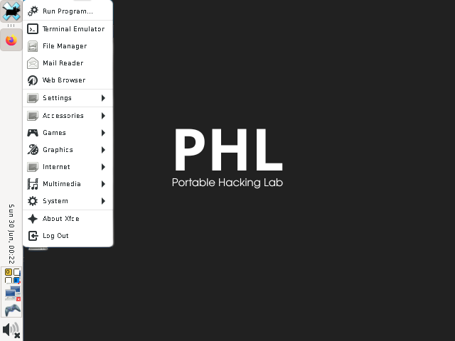

#  PHL - Portable Hacking Lab

[](https://github.com/edwards-tech/PHL/blob/main/LICENSE)
[](https://www.example.com)
[](https://www.example.com)

> Ultra-Portable Linux Privacy Workstation on R36S Handheld  
> *Ethical hacking toolkit in your pocket*


## 🔥 Project Vision

PHL transforms the $50 R36S gaming handheld into a powerful, privacy-focused Linux workstation. This is not just another emulation device - it's a full-featured portable Linux computer with emphasis on:

- Privacy-first design (no telemetry, minimal tracking)
- Hacker-friendly environment (CLI tools, pentesting apps)
- Pocket form-factor (fits in your jeans pocket)
- Open source philosophy (all components can be audited)

## 📦 Key Features

### 🖥️ Core System
| Component       | Implementation         | Why We Chose It                 |
|----------------|-----------------------|--------------------------------|
| OS         | ArkOS K36 (Arch-based)| Lightweight yet powerful base  |
| Desktop    | XFCE4                 | Perfect balance of speed/features |
| Kernel     | Custom 5.15           | Optimized for RK3326 SoC       |

### 🔒 Privacy Suite
- Secure Messaging:
  - SimpleX Chat (CLI version) - *No accounts, no metadata*
  - Telegram Desktop (Flatpak) - *Official secure client*
- Anonymous Networking:
  - Tor with auto-config
  - I2P support (optional)

### 🛠️ Hacking Toolkit
`bash
nmap wireshark-qt aircrack-ng python3 git htop netcat socat

## 🔐 Key Advantages of PHL

###  Unmatched Privacy
- **Zero telemetry** - Unlike Windows/macOS/Android, no data is collected
- **Pure Linux** with no backdoors or modifications
- **Terminal-based SimpleX Chat** - no graphical indicators of messenger activity
- **Tor-over-VPN** - Double encrypted traffic by default

###  Complete Control
```bash
# Example: Installing custom software
sudo pacman -S your-package   # Via official repos
flatpak install your-package  # Or via Flatpak
